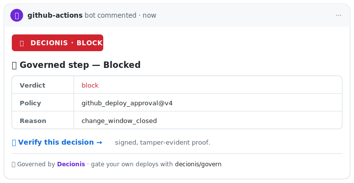

# 🛡️ Decionis Action Gate

**Govern high-risk actions before they execute.**

[](https://github.com/marketplace/actions/decionis-action-gate)
[](https://github.com/decionis/govern)
[](./LICENSE)

> **Before software executes, Decionis decides whether it's allowed to.**

GitHub Actions runs the code. **Decionis decides whether the run is authorized.** Add one step and every deploy, migration, infra change, or AI-generated PR is evaluated against your policy, approvals, and risk — then **allowed, blocked, or escalated** before it executes, with a signed Decision Dossier as audit-ready proof.

Start in **shadow mode** — it never fails your build, so you see exactly what Decionis would govern. Enforce with one line when you're ready.

---

## The question every pipeline now faces

AI coding agents — **Claude Code, Copilot, Cursor, Codex, OpenHands** — now open PRs, edit workflows, write migrations, and trigger deploys. The hard question is no longer _"who wrote this code?"_ It's:

> **Should this action be allowed to execute?**

That's the Action Gate.

## 30-second quickstart

**Wrap the command you want to govern.** Decionis runs it _through_ the gate, so it can't execute without an authorizing verdict:

```yaml
- uses: decionis/govern@v1
  with:
    api-key: ${{ secrets.DECIONIS_API_KEY }}
    org-id: ${{ secrets.DECIONIS_ORG_ID }}
    workflow-key: github_deploy_approval
    action: production-deploy
    run: ./deploy.sh # ← Decionis runs this ONLY if it authorizes the action
```

On `allow` the command runs. On `block`/`escalate` it **never runs** and the step fails. Try it risk-free with `mode: shadow` — the command still runs, but Decionis only records the verdict (never fails the build):

```yaml
- uses: decionis/govern@v1
  with:
    api-key: ${{ secrets.DECIONIS_API_KEY }}
    org-id: ${{ secrets.DECIONIS_ORG_ID }}
    workflow-key: github_deploy_approval
    action: production-deploy
    run: ./deploy.sh
    mode: shadow # observe-only; records the verdict, never blocks
    comment-pr: "true" # posts the verdict + verify link on the PR
```

Need keys? Create them free at **[decionis.com/quickstart?source=github_action](https://decionis.com/quickstart?source=github_action)** — no card, no call.

### Cryptographic proof, verified at the target

Set `request-grant: true` and every authorized run carries a short-lived, single-use, signed **Execution Grant** — `DECIONIS_EXECUTION_GRANT` in the command's environment. Your deploy target verifies it against Decionis's public keys before it acts, so authorization is proven where the action actually happens.

```yaml
- uses: decionis/govern@v1
  with:
    workflow-key: github_deploy_approval
    action: production-deploy
    request-grant: true
    grant-audience: prod-us-east
    run: ./deploy.sh # presents $DECIONIS_EXECUTION_GRANT to the target
```

### Zero standing credentials

Take secrets out of CI entirely. Register a target's credential with Decionis once, and it's released only in exchange for an authorized run — your pipeline holds nothing to leak. See [`examples/gate-deploy-broker.yml`](./examples/gate-deploy-broker.yml), or federate **GCP Workload Identity Federation** / **Azure** so the cloud issues credentials only for a Decionis-authorized deploy.

---

## Three concepts

### 1. 🚦 Action Gate

One verdict before execution — **`allow`**, **`block`**, or **`escalate`**. Composable into any later step via `steps.<id>.outputs.decision`.

### 2. 🟣 Shadow Mode

`mode: shadow` shows exactly what Decionis would govern, without ever failing a build. Enforce when you're ready — one line.

### 3. 🧾 Decision Dossiers

Every verdict produces a signed, public-verifiable [Decision Dossier](https://decionis.com/dossier-example?source=github_action): **why** it happened, **who** approved it, **which policy** applied, and the **risk**. The verify link unfurls as an OG card in Slack / Teams / LinkedIn — paste it in an incident, a change ticket, or an audit and it holds up.

---

## Your policy — what the gate evaluates against

Every gated action is evaluated against **your organization's policy**: the rules that decide whether an action is **allowed, blocked, restrained, or escalated**. You own those rules.

- **Zero config to start.** Out of the box, Decionis applies a built-in **default policy pack** for your workflow's vertical (core, finance, hospitality, and more), so the 30-second quickstart governs immediately — no policy authoring required.
- **Make it yours, and it's versioned.** Add or update rules at any time; Decionis **versions every change**, and each verdict's Decision Dossier records exactly **which policy version applied** — so an audit can trace any decision back to the rule that made it.
- **Bring policy from where it already lives.** Build rules dynamically, **upload or paste** a policy file, or **connect the source of truth** and Decionis keeps the encoded policy in sync — **Google Drive, GitHub, Jira, Confluence, Notion, or SAP.**

The result: the gate isn't a generic check — it enforces _your_ rules, kept current with how your organization actually documents them.

### Policy as a file: `DECIONIS_POLICY.md`

Keep policy where developers already work — in the repo, in Markdown, reviewed by PR. Drop a **`DECIONIS_POLICY.md`** at your repo root and the action reads it, **content-hashes it, and injects it into every decision** — so the gate governs against your repo's policy and the signed Decision Dossier records exactly which policy (by `sha256`) applied. Change the file, get a new recorded revision. No dashboard step.

```yaml
- uses: decionis/govern@v1
  with:
    workflow-key: github_deploy_approval
    action: production-deploy
    # policy-file: DECIONIS_POLICY.md   # default; set "" to disable
    run: ./deploy.sh
```

Outputs `policy-sha256` + `policy-path`. A missing/unreadable file never fails the gate. See the annotated [example policy](./examples/DECIONIS_POLICY.md) to copy. For an **org-wide** policy, point a Git source connector at your `.github` repo's `DECIONIS_POLICY.md`.

---

## Govern AI-generated changes

When an AI agent opens a PR or triggers a deploy, gate it **before** it merges or ships:

```yaml
- uses: decionis/govern@v1
  id: gate
  with:
    api-key: ${{ secrets.DECIONIS_API_KEY }}
    org-id: ${{ secrets.DECIONIS_ORG_ID }}
    workflow-key: ai_change_gate
    action: ai-generated-pr
    comment-pr: "true"
    payload: |
      { "author": "${{ github.actor }}", "agent_generated": true }
```

See [`examples/gate-ai-agent-pr.yml`](./examples/gate-ai-agent-pr.yml) for the full recipe (auto-detects agent authorship and requires a human verdict on risky changes).

## Also governs

- **Deployments** — production releases, blue/green cutovers
- **Infrastructure** — `terraform apply`, Pulumi, CDK
- **Data** — database migrations, destructive jobs
- **Privileged workflows** — release pipelines, secrets rotation, IAM changes

## What reviewers see on the PR

A single, **self-updating** comment — it stays current on every run:



## 📌 Add the badge

Show your pipeline is governed — and let other devs discover the gate. Also emitted as the `badge-markdown` output (pointing at the live verify URL):

```markdown
[](https://github.com/decionis/govern)
```

[](https://github.com/decionis/govern)

---

## Recipes

Copy-paste workflows in [`examples/`](./examples/):

| Recipe                                                              | What it gates                                                                    |
| ------------------------------------------------------------------- | -------------------------------------------------------------------------------- |
| [`gate-ai-agent-pr.yml`](./examples/gate-ai-agent-pr.yml)           | AI-generated PRs (Claude Code, Copilot, Cursor…) before merge.                   |
| [`gate-deploy.yml`](./examples/gate-deploy.yml)                     | A production deploy on a `block` verdict (enforce).                              |
| [`gate-terraform.yml`](./examples/gate-terraform.yml)               | `terraform apply` on the plan's blast radius.                                    |
| [`gate-release.yml`](./examples/gate-release.yml)                   | A verdict before a tagged release ships.                                         |
| [`auto-merge-dependabot.yml`](./examples/auto-merge-dependabot.yml) | Auto-merge a dependency PR only when the verdict is `allow`.                     |
| [`gate-pr-comment.yml`](./examples/gate-pr-comment.yml)             | Shadow-mode evaluator that comments without failing the build.                   |
| [`gate-deploy-broker.yml`](./examples/gate-deploy-broker.yml)       | Release deploy credentials only for an authorized run — no standing secrets.     |
| [`gate-deploy-gcp-wif.yml`](./examples/gate-deploy-gcp-wif.yml)     | GCP Workload Identity Federation — the cloud issues credentials only on `allow`. |
| [`gate-deploy-azure.yml`](./examples/gate-deploy-azure.yml)         | Azure federated credentials — the cloud issues credentials only on `allow`.      |

## Inputs

| Input                | Required | Default                       | Description                                                        |
| -------------------- | -------- | ----------------------------- | ------------------------------------------------------------------ |
| `api-key`            | yes      | —                             | Decionis API key with `protocol:evaluate` scope. Pass as a secret. |
| `org-id`             | yes      | —                             | Decionis org id (UUID).                                            |
| `workflow-key`       | yes      | —                             | Workflow key registered in Decionis policy.                        |
| `action`             | no       | —                             | Short label for what's being gated (e.g. `production-deploy`).     |
| `run`                | no       | —                             | Command Decionis runs **only if authorized** (the enforcing path). |
| `shell`              | no       | `bash`                        | Shell for `run` — `bash` or `sh`.                                  |
| `request-grant`      | no       | `false`                       | Issue a signed Execution Grant on an authorizing verdict.          |
| `grant-audience`     | no       | —                             | Bind the grant to a target/env id (e.g. `prod-us-east`).           |
| `payload`            | no       | _built from workflow context_ | JSON object describing the action being gated.                     |
| `fail-on`            | no       | `block`                       | `block` / `escalate` / `block_or_escalate` / `never`.              |
| `mode`               | no       | `enforce`                     | `enforce` or `shadow`. Shadow never fails the step.                |
| `comment-pr`         | no       | `false`                       | Post (and update in place) the verdict as a PR comment.            |
| `show-attribution`   | no       | `true`                        | Include the "Governed by Decionis" footer on the PR comment.       |
| `api-base-url`       | no       | `https://api.decionis.com`    | Override for staging / self-host.                                  |
| `site-base-url`      | no       | `https://decionis.com`        | Override for staging / self-host.                                  |
| `request-timeout-ms` | no       | `20000`                       | Timeout for the evaluate-decision call.                            |

## Outputs

| Output             | Description                                                                   |
| ------------------ | ----------------------------------------------------------------------------- |
| `decision`         | `allow` / `block` / `escalate` / `restrain`                                   |
| `dossier-id`       | Signed Decision Dossier id for this evaluation.                               |
| `verify-url`       | Public verify URL (`?sig=` so unfurls render the verdict OG card).            |
| `policy-version`   | Policy version (string) that produced the verdict.                            |
| `reason-code`      | Stable reason code (string), if returned.                                     |
| `badge-markdown`   | Ready-to-paste "Governed by Decionis" badge linking to the live verify URL.   |
| `executed`         | `true` if a `run` command was authorized and executed, `false` if blocked.    |
| `execution-grant`  | Signed Execution Grant (EdDSA JWT) when `request-grant: true` and authorized. |
| `grant-expires-at` | ISO timestamp when the Execution Grant expires.                               |

## Permissions

Default (`contents: read`) is enough. To enable `comment-pr: 'true'`:

```yaml
permissions:
  contents: read
  pull-requests: write
```

## How it works

The action calls `POST /v1/protocol/evaluate-decision` with the action label + payload (or a payload built from the workflow context), and returns the signed verdict. Inputs are echoed into the dossier so you can audit exactly what produced it. `shadow` mode **never** fails the step; a non-200 from the API fails the step with the status — no silent green builds.

---

<sub>Built by [Decionis](https://decionis.com?source=github_action_readme) · [Quickstart](https://decionis.com/quickstart?source=github_action) · [Dossier example](https://decionis.com/dossier-example?source=github_action) · Apache-2.0 licensed</sub>
